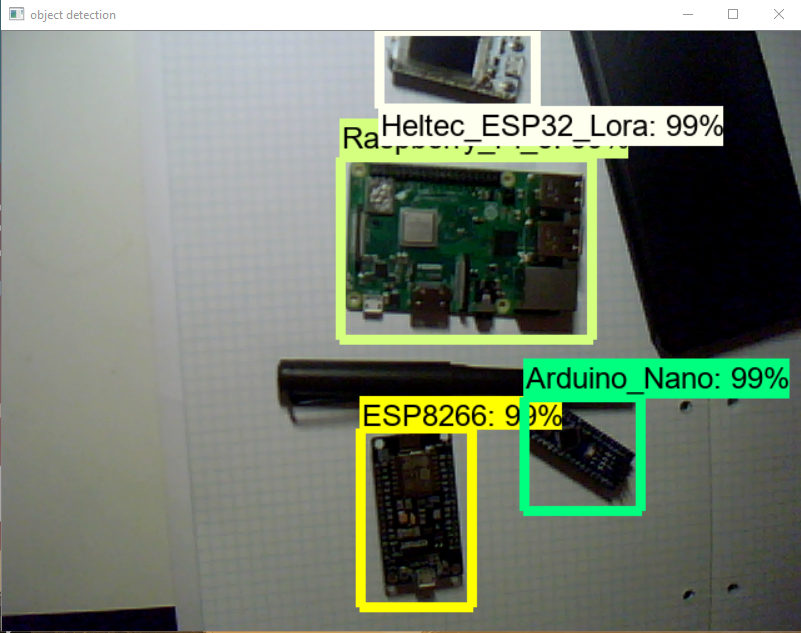
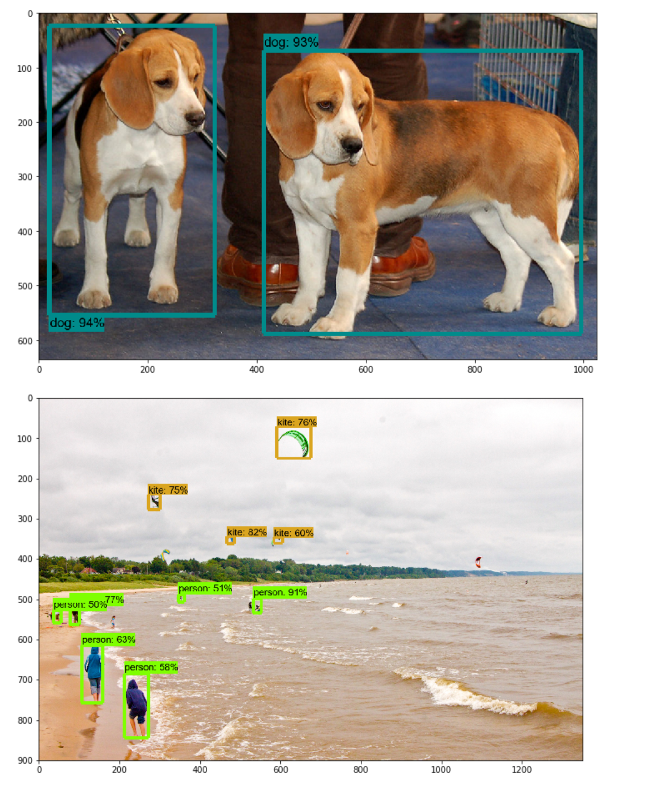
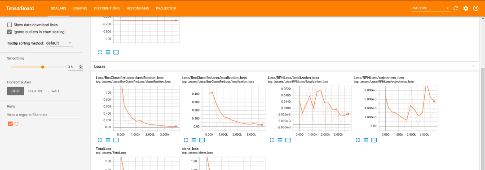

# How to train a custom object detection model with the Tensorflow Object Detection API
(ReadME inspired by [EdjeElectronics](https://github.com/EdjeElectronics))



## Introduction

## Steps:

### 1. Installation

#### Clone the repository and install dependencies

First we need to clone the Tensorflow models repository. This can be done by either cloning the repository directly or by typing **git clone https://github.com/tensorflow/models** inside a command line.

After cloning the repository it is a good idea to install all the dependencies. This can be done by typing:

```bash
pip install --user Cython
pip install --user contextlib2
pip install --user pillow
pip install --user lxml
pip install --user jupyter
pip install --user matplotlib
```

#### Install the COCO API

COCO is a large image dataset designed for object detection, segmentation, person keypoints detection, stuff segmentation, and caption generation. If you want to use the data-set and evaluation metrics you need to clone the cocoapi repository and copy the pycocotools subfolder to the tensorflow/models/research directory.

```bash
git clone https://github.com/cocodataset/cocoapi.git
cd cocoapi/PythonAPI
make
cp -r pycocotools <path_to_tensorflow>/models/research/
```

Using make won't work on windows. To install the cocoapi on windows the following command can be used:

```bash
pip install "git+https://github.com/philferriere/cocoapi.git#egg=pycocotools&subdirectory=PythonAPI"
```

#### Protobuf Installation/Compilation

The Tensorflow Object Detection API uses .proto files. These files need to be compiled into .py files in order for the Object Detection API to work properly. Google provides a programmed called Protobuf that can compile these files.

Protobuf can be downloaded from this website. After downloading you can extract the folder in a directory of your choice.

After extracting the folder you need to go into models/research and use protobuf to extract python files from the proto files in the object_detection/protos directory.

The official installation guide uses protobuf like:

```bash
./bin/protoc object_detection/protos/*.proto --python_out=. 
```

But the * which stands for all files didn’t work for me so I wrote a little Python script to execute the command for each .proto file.

```python
import os
import sys
args = sys.argv
directory = args[1]
protoc_path = args[2]
for file in os.listdir(directory):
    if file.endswith(".proto"):
        os.system(protoc_path+" "+directory+"/"+file+" --python_out=.")
```

This file needs to be saved inside the research folder and I named it use_protobuf.py. Now we can use it by going into the console and typing:

```bash
python use_protobuf.py <path to directory> <path to protoc file>  Example: python use_protobuf.py object_detection/protos C:/Users/Gilbert/Downloads/bin/protoc 
```

#### Add necessary environment variables and finish Tensorflow Object Detection API installation

Lastly we need to add the research and research slim folder to our environment variables and run the setup.py file.

To add the paths to environment variables in Linux you need to type:

```bash
export PYTHONPATH=$PYTHONPATH:<PATH_TO_TF>/TensorFlow/models/research
export PYTHONPATH=$PYTHONPATH:<PATH_TO_TF>/TensorFlow/models/research/object_detection
export PYTHONPATH=$PYTHONPATH:<PATH_TO_TF>/TensorFlow/models/research/slim
```

On windows you need to at the path of the research folder and the research/slim to your PYTHONPATH environment variable (See Environment Setup) .

To run the setup.py file we need to navigate to tensorflow/models/research and run:

```bash
# From within TensorFlow/models/research/
python setup.py build
python setup.py install
```

This completes the installation of the object detection api. To test if everything is working correctly, run the object_detection_tutorial.ipynb notebook from the object_detection folder.

> Causion: The new object_detection_tutorial.ipynb only works with Tensorflow 2.0. If you want to use Tensorflow 1.x get the file from my Github instead.

If your installation works correctly you should see the following output:



### Run the Tensorflow Object Detection API with Docker

Installing the Tensorflow Object Detection API can be hard because there are lots of errors that can occur depending on your operating system. Docker makes it easy to setup the Tensorflow Object Detection API because you only need to download the files inside the [docker folder](docker/) and run **docker-compose up**. 

After running the command docker should automatically download and install everything needed for the Tensorflow Object Detection API and open Jupyter on port 8888. If you also want to have access to the bash for training models you can simply say **docker exec -it CONTAINER_ID**. For more information check out [Dockers documentation](https://docs.docker.com/).

If you experience any problems with the docker files be sure to let me know.

### 2. Gathering data

Now that the Tensorflow Object Detection API is ready to go, we need to gather the images needed for training. 

To train a robust model, we need lots of pictures that should vary as much as possible from each other. That means that they should have different lighting conditions, different backgrounds and lots of random objects in them.

You can either take the pictures yourself or you can download them from the internet. For my microcontroller detector, I have four different objects I want to detect (Arduino Nano, ESP8266, Raspberry Pi 3, Heltect ESP32 Lora).

I took about 25 pictures of each individual microcontroller and 25 pictures containing multiple microcontrollers using my smartphone. After taking the pictures make sure to transform them to a resolution suitable for training (I used 800x600).


You can use the [resize_images script](resize_images.py) to resize the image to the wanted resolutions.

```bash
python resize_images.py -d images/ -s 800 600
```

After you have all the images move about 80% to the object_detection/images/train directory and the other 20% to the object_detection/images/test directory. Make sure that the images in both directories have a good variety of classes.

### 3. Labeling data

With all the pictures gathered, we come to the next step - labeling the data. Labeling is the process of drawing bounding boxes around the desired objects.

LabelImg is a great tool for creating a object detection data-set.

[LabelImg GitHub](https://github.com/tzutalin/labelImg)

[LabelImg Download](https://www.dropbox.com/s/tq7zfrcwl44vxan/windows_v1.6.0.zip?dl=1)

Download and install LabelImg. Then point it to your images/train and images/test directories, and draw a box around each object in each image.


LabelImg supports two formats, PascalVOC and Yolo. For this tutorial make sure to select PascalVOC. LabelImg saves a xml file containing the label data for each image. These files will be used to create a tfrecord file, which can be used to train the model.

### 4. Generating Training data

With the images labeled, we need to create TFRecords that can be served as input data for training of the object detector. In order to create the TFRecords we will use two scripts from [Dat Tran’s raccoon detector](https://github.com/datitran/raccoon_dataset). Namely the xml_to_csv.py and generate_tfrecord.py files.

After downloading both scripts we can first of change the main method in the   xml_to_csv file so we can transform the created xml files to csv correctly.

```python
# Old:
def main():
    image_path = os.path.join(os.getcwd(), 'annotations')
    xml_df = xml_to_csv(image_path)
    xml_df.to_csv('raccoon_labels.csv', index=None)
    print('Successfully converted xml to csv.')
# New:
def main():
    for folder in ['train', 'test']:
        image_path = os.path.join(os.getcwd(), ('images/' + folder))
        xml_df = xml_to_csv(image_path)
        xml_df.to_csv(('images/'+folder+'_labels.csv'), index=None)
	print('Successfully converted xml to csv.')
```

Now we can transform our xml files to csvs by opening the command line and typing:

```bash
python xml_to_csv.py
```

These creates two files in the images directory. One called test_labels.csv and another one called train_labels.csv.

Next, open the generate_tfrecord.py file and replace the labelmap inside the class_text_to_int method with your own label map.

Old:
```python
# TO-DO replace this with label map
def class_text_to_int(row_label):
    if row_label == 'basketball':
        return 1
    elif row_label == 'shirt':
        return 2
    elif row_label == 'shoe':
        return 3
    else:
        return None
```

New:
```python
def class_text_to_int(row_label):
    if row_label == 'Raspberry_Pi_3':
        return 1
    elif row_label == 'Arduino_Nano':
        return 2
    elif row_label == 'ESP8266':
        return 3
    elif row_label == 'Heltec_ESP32_Lora':
        return 4
    else:
        return None
```

Now the TFRecords can be generated by typing:

```bash
python generate_tfrecord.py --csv_input=images/train_labels.csv --image_dir=images/train --output_path=train.record
python generate_tfrecord.py --csv_input=images/test_labels.csv --image_dir=images/test --output_path=test.record
```

These two commands generate a train.record and a test.record file which can be used to train our object detector.

### 5. Getting ready for training

The last thing we need to do before training is to create a label map and a training configuration file.

#### 5.1 Creating a label map

The label map maps an id to a name. We will put it in a folder called training, which is located in the object_detection directory. The labelmap for my detector can be seen below.

```python
item {
    id: 1
    name: 'Raspberry_Pi_3'
}
item {
    id: 2
    name: 'Arduino_Nano'
}
item {
    id: 3
    name: 'ESP8266'
}
item {
    id: 4
    name: 'Heltec_ESP32_Lora'
}
```

The id number of each item should match the id of specified in the generate_tfrecord.py file.

#### 5.2 Creating the training configuration

Lastly we need to create a training configuration file. As a base model I will use faster_rcnn_inception, which just like a lot of other models can be downloaded from the [Tensorflow detection model zoo](https://github.com/tensorflow/models/blob/master/research/object_detection/g3doc/detection_model_zoo.md).

Because we are using a faster_rcnn_inception model we can choose one of its predefined configurations. We will use faster_rcnn_inception_v2_pets.config located inside the models/research/object_detection/samples/configs folder.

Copy the config file to the training directory- Then open it inside a text editor and make the following changes:

* Line 9: change the number of classes to number of objects you want to detect (4 in my case)

* Line 106: change fine_tune_checkpoint to the path of the model.ckpt file:

    * ```fine_tune_checkpoint: "C:/Users/Gilbert/Downloads/Other/models/research/object_detection/faster_rcnn_inception_v2_coco_2018_01_28/model.ckpt"```

* Line 123: change input_path to the path of the train.records file:

    * ```input_path: "C:/Users/Gilbert/Downloads/Other/models/research/object_detection/train.record"```

* Line 135: change input_path to the path of the test.records file:

    * ```input_path: "C:/Users/Gilbert/Downloads/Other/models/research/object_detection/test.record"```

* Line 125 and 137: change label_map_path to the path of the label map:

    * ```label_map_path: "C:/Users/Gilbert/Downloads/Other/models/research/object_detection/training/labelmap.pbtxt"```

* Line 130: change num_example to the number of images in your test folder.

### 6. Training the model

To train the model execute the following command in the command line:

```bash
python model_main.py --logtostderr --model_dir=training/ --pipeline_config_path=training/faster_rcnn_inception_v2_pets.config
```

If everything was setup correctly the training should begin shortly and you should see something like the following:


Every few minutes the current loss gets logged to Tensorboard. Open Tensorboard by opening a second command line, navigating to the object_detection folder and typing:

```tensorboard --logdir=training```

This will open a webpage at localhost:6006.



The training scrips saves checkpoints about every five minutes. Train the model until it reaches a satisfying loss then you can terminat the training process by pressing Ctrl+C.

### 7. Exporting the inference graph

Now that we have a trained model we need to generate an inference graph, which can be used to run the model. For doing so we need to first of find out the highest saved step number. For this, we need to navigate to the training directory and look for the model.ckpt file with the biggest index.

Then we can create the inference graph by typing the following command in the command line.

```bash
python export_inference_graph.py --input_type image_tensor --pipeline_config_path training/faster_rcnn_inception_v2_pets.config --trained_checkpoint_prefix training/model.ckpt-XXXX --output_directory inference_graph
```

XXXX represents the highest number.

### 8. Using the model for inference

After training the model it can be used in many ways. For examples on how to use the model check out my other repositories.

* [Inference with Tensorflow 1.x](https://github.com/TannerGilbert/Tutorials/tree/master/Tensorflow%20Object%20Detection)

## Appendix

### Common Errors

The Tensorflow Object Detection API has lots of painful error that can be quite hard to solve. In this appendix section you can find the errors I encountered and how to solve them.

#### 1. ModuleNotFoundError: No module named 'object_detection', ImportError : cannot import name 'string_int_label_map_pb2, No module named nets

These errors occur when the object detection API wasn't installed correctly. Make sure to follow [my installation guide](https://gilberttanner.com/blog/installing-the-tensorflow-object-detection-api) correctly.


#### 2. AttributeError: module 'tensorflow' has no attribute 'app', AttributeError: module 'tensorflow' has no attribute 'contrib'

Training models with Tensorflow 2.0 insn't supported yet. I will update the repository as soon as it is supported.

### Common Questions

#### 1. How do I extract the images inside the bounding boxes?

```python
output_directory = 'some dir'

# get label and coordinates of detected objects
output = []
for index, score in enumerate(output_dict['detection_scores']):
    label = category_index[output_dict['detection_classes'][index]]['name']
    ymin, xmin, ymax, xmax = output_dict['detection_boxes'][index]
    output.append((label, int(xmin * image_width), int(ymin * image_height), int(xmax * image_width), int(ymax * image_height)))

# Save images and labels
for l, x_min, y_min, x_max, y_max in output:
    array = cv2.cvtColor(np.array(image_show), cv2.COLOR_RGB2BGR)
    image = Image.fromarray(array)
    cropped_img = image.crop((x_min, y_min, x_max, y_max))
    file_path = output_directory+'/images/'+str(len(df))+'.jpg'
    cropped_img.save(file_path, "JPEG", icc_profile=cropped_img.info.get('icc_profile'))
    df.loc[len(df)] = [datetime.datetime.now(), file_path]
    df.to_csv(output_directory+'/results.csv', index=None
``` 

#### 2. How do I host a model?

There are multiple ways to host a model. You can create a Restful API with [Tensorflow Serving](https://github.com/tensorflow/serving) or by creating your own websites. You can also integrate the model into a website by transforming your model to [Tensorflow Lite](https://www.tensorflow.org/lite/convert). 

## Contribution

Anyone is welcome to contribute to this repository, however, if you decide to do so I would appreciate it if you take a moment and review the [guidelines](./.github/CONTRIBUTING.md).

## Author
 **Gilbert Tanner**
 
## Support me

<a href="https://www.buymeacoffee.com/gilberttanner" target="_blank"></a>

## License

This project is licensed under the MIT License - see the [LICENSE.md](LICENSE) file for details